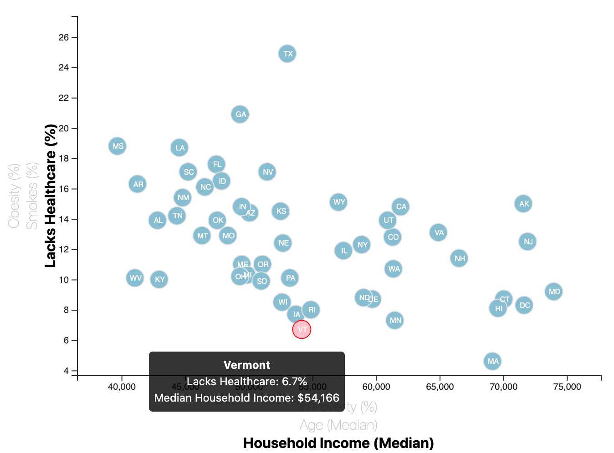
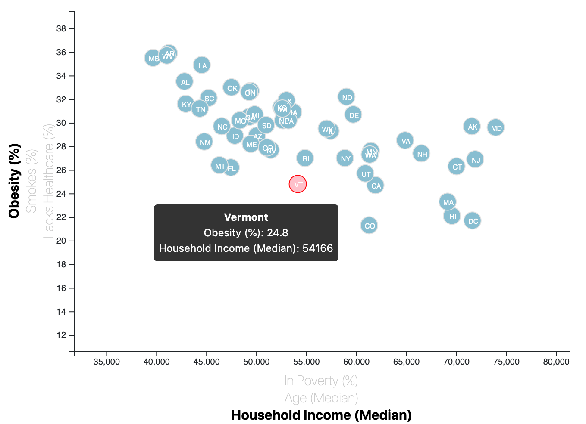

# D3-Challenge
Data Journalism plotting Census data using D3

For this assignment, I had to use D3 to read a [CSV file](D3_data_journalism/assets/data/data.csv) with data from the U.S. Census and then plot the data points.

You can view the completed assignment with the interactive chart [here](https://improvbutterfly.github.io/D3-Challenge/D3_data_journalism/).

## Sample screenshots

